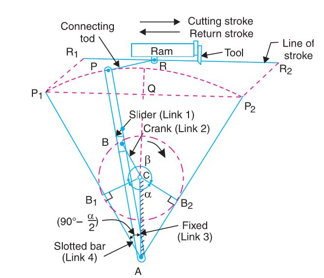
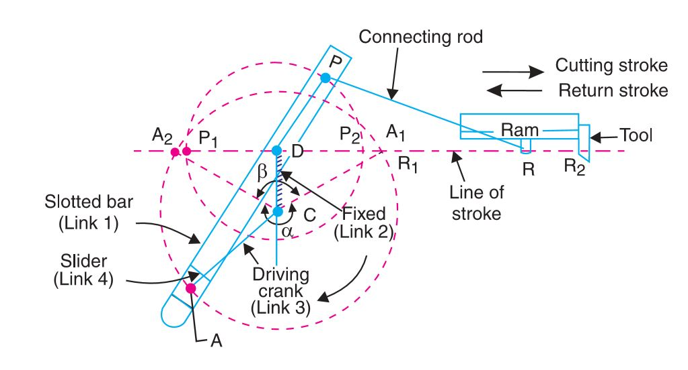

# Introduction
A quick return mechanism is an apparatus that converts circular motion into reciprocating motion in presses and shaping machines, which are utilized to shape stocks of metal into flat surfaces. This mechanism is mostly used in shaping machines, slotting machines and in rotary internal combustion engines. The word quick return indicates that the returning stoke is faster than the forward stroke which help the tool to retrieve back faster after doing a particular job. Quick-return mechanisms feature different input durations for their working and return strokes. The time ratio of a Quick Return mechanism is the ratio of the change in input displacement during the working stroke to its change during the return stroke.

# Theory
From the definition of mechanisms it can be realize that by fixing the links of a closed chain one at a time, we can get as many different mechanisms as the numbers of link in the chain. This process of fixing different links of a same kinematic chain to produce distinct mechanisms is called kinematic inversion. By distinct, it is meant that the input-output relation as given by the absolute motions of the links connected to the frame is different for these mechanisms. An Oldham′s coupling is a third inversion of double slider crank chain.

## Inversions of Single Slider Crank Chain

A single slider crank chain is a four-link mechanism. We know that by fixing, in turn, different links in a kinematic chain, an inversion is obtained and we can obtain as many mechanisms as the links in a kinematic chain. It is thus obvious, that four inversions of a single slider crank chain are possible. These inversions are found in the following mechanisms. 1) Pendulum pump or Bull engine. 2) Oscillating cylinder engine. mechanism. 3) Rotary internal combustion engine or Gnome engine. 4)Crank and slotted lever quick return motion mechanism. 5) Whitworth quick return motion mechanism.

## Crank and slotted lever quick return motion mechanism

This mechanism is mostly used in shaping machines, slotting machines and in rotary internal combustion engines. In this mechanism, the link AC (i.e. link 3) forming the turning pair is fixed, as shown in Fig.1. The link 3 corresponds to the connecting rod of a reciprocating steam engine. The driving crank CB revolves with uniform angular speed about the fixed centre C. A sliding block attached to the crank pin at B slides along the slotted bar AP and thus causes AP to oscillate about the pivoted point A. A short link PR transmits the motion from AP to the ram which carries the tool and reciprocates along the line of stroke R1R2. The line of stroke of the ram (i.e. R1R2) is perpendicular to AC produced.

***Fig1: Crank and slotted lever quick return motion mechanism.***

In the extreme positions, AP1 and AP2 are tangential to the circle and the cutting tool is at the end of the stroke. The forward or cutting stroke occurs when the crank rotates from the position CB1 to CB2 (or through an angle β) in the clockwise direction. The return stroke occurs when the crank rotates from the position CB2 to CB1 (or through angle α) in the clockwise direction. Since the crank has uniform angular speed, therefore,

$$ \\frac{ Time of cu \\epsilon gstroke }{ Time of return stroke } = \\frac{ \\beta }{ \\alpha } $$

## Whitworth quick return motion mechanism

This mechanism is mostly used in shaping and slotting machines. In this mechanism, the link CD (link 2) forming the turning pair is fixed, as shown in Fig. 2. The link 2 corresponds to a crank in a reciprocating steam engine. The driving crank CA (link 3) rotates at a uniform angular speed. The slider (link 4) attached to the crank pin at A slides along the slotted bar PA (link 1) which oscillates at a pivoted point D. The connecting rod PR carries the ram at R to which a cutting tool is fixed. The motion of the tool is constrained along the line RD produced, i.e. along a line passing through D and perpendicular to CD.

***Fig2: Whitworth quick return motion mechanism.***

When the driving crank CA moves from the position CA1 to CA2 (or the link DP from the position DP1 to DP2) through an angle α in the clockwise direction, the tool moves from the left hand end of its stroke to the right hand end through a distance 2 PD. Now when the driving crank moves from the position CA2 to CA1 (or the link DP from DP2 to DP 1 ) through an angle β in the clockwise direction, the tool moves back from right hand end of its stroke to the left hand end

A little consideration will show that the time taken during the left to right movement of the ram (i.e. during forward or cutting stroke) will be equal to the time taken by the driving crank to move from CA1 to CA2. Similarly, the time taken during the right to left movement of the ram (or during the idle or return stroke) will be equal to the time taken by the driving crank to move from CA2 to CA1.

Since the crank link CA rotates at uniform angular velocity therefore time taken during the cutting stroke (or forward stroke) is more than the time taken during the return stroke. In other words, the mean speed of the ram during cutting stroke is less than the mean speed during the return stroke. The ratio between the time taken during the cutting and return strokes is given by

$$ \\frac{Time of cu \\epsilon gstroke}{Time of return stroke   } = \\frac{\\alpha}{\\beta} $$

# Video

## A quick return mechanism (used in Shapers)

<video width="420" height="340" controls=""><source src="./vid16/part7.mp4" type="video/mp4"></video>

